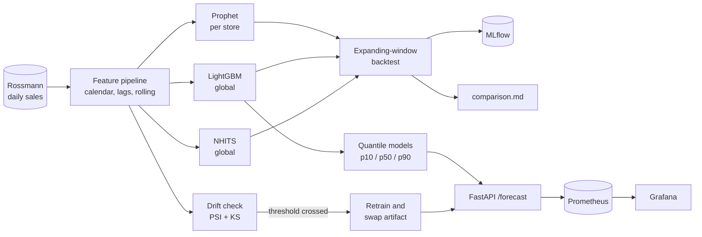

# foresight

Demand forecasting on Rossmann store sales: three model families benchmarked against each other under expanding-window cross-validation, then the winner served behind an API with prediction intervals, drift-triggered retraining, and metrics.

The comparison is the point. A single model with no baseline proves nothing, and a single train/test split at the end of a series flatters every model that touches it. Both of those are measured here rather than asserted.

## Problem

Retail demand forecasting projects usually ship one model, one accuracy number, and one train/test split. That leaves the two questions a buyer actually has unanswered: is this better than something simpler, and is that number going to hold next month.

This repo answers both by construction. Three model families train and evaluate on an identical store sample and identical folds, and the evaluation uses expanding-window cross-validation so the reported error is an average over several periods rather than whichever window happened to land at the end of the data.

## Architecture



Each model family runs in its own subprocess. That is a requirement, not tidiness: LightGBM and PyTorch each bundle their own OpenMP runtime, and loading both into one process deadlocks on macOS with no error at all.

## Results

Three folds of 42 days each, walking backward from the end of the training data. Same 12 stores, stratified across all four store types, for every model. Metrics averaged across folds. Lower is better, all figures percentages.

| Model | Scope | MAPE | WAPE | sMAPE |
|---|---|---|---|---|
| **LightGBM** | global, one model over all stores | **8.09** | **8.17** | **8.12** |
| Prophet | per store | 10.98 | 11.25 | 11.13 |
| NHITS | global, neural | 11.92 | 11.94 | 11.88 |

Per-fold WAPE, which is what the averages above are hiding:

| Fold | Train through | Test window | Prophet | LightGBM | NHITS |
|---|---|---|---|---|---|
| 1 | 2015-03-27 | Mar 28 to May 8 | 12.90 | 9.24 | 15.29 |
| 2 | 2015-05-08 | May 9 to Jun 19 | 11.17 | 7.94 | 10.75 |
| 3 | 2015-06-19 | Jun 20 to Jul 31 | 9.68 | 7.32 | 9.78 |

Two things worth reading out of that table.

**LightGBM wins every fold, so its lead is not an artifact of where a split landed.** Prophet and NHITS trade second and third place depending on the window, so the gap between those two is inside the noise of which period you evaluate on and should not be reported as one beating the other.

**The single holdout split flatters every model.** Fold 3 is exactly the split each individual baseline script uses on its own, and it is the best fold for all three models: by 0.85 WAPE points for LightGBM, 1.57 for Prophet, and 2.16 for NHITS. Had this project reported one end-of-series holdout, as most do, every number would have looked better than the model deserves, and NHITS would have looked closer to Prophet than it is.

**The neural model does not earn its complexity here**, and that is reported rather than tuned away. Twelve series and a few hundred training steps is not the regime NHITS is built for; it needs many more related series to beat a gradient booster with good lag features. Reporting it anyway is the honest outcome of committing to a three-way comparison before knowing the result.

Full writeup with the caveats, generated from the fold results rather than written by hand: [evals/comparison.md](evals/comparison.md).

## Backtesting design

**Why not a single holdout split.** A holdout at the end of the series gives one number per model and no sense of whether it is stable. Rossmann has a strong December peak and promo-driven swings, so a window that happens to contain or miss those moves the result. Several folds show whether an advantage survives across periods. The numbers above are the evidence that this mattered.

**Why expanding rather than rolling.** Each fold trains on everything before its test window, including previous folds' test days, so fold 3 trains on more history than fold 1. That matches how the model would actually be retrained in production, where you do not throw away last quarter when this quarter arrives.

**What is held constant.** All three models see the same 12 stores and the same fold boundaries, because comparing models fitted on different samples measures the sampling, not the models. The store sample is stratified across store types and pinned in `foresight/config.py` for that reason.

**Where the comparison is not apples to apples, stated plainly.** Prophet and LightGBM train on open days only. NHITS keeps closed days in training because it needs a regularly spaced series, with `Open` passed as a known future input. All three are scored on the same open-day test rows, so the evaluation is identical even though the training inputs differ slightly.

**Leakage.** Lag and rolling features are computed on data shifted one day within each store, so a feature for day t never sees day t's own value. There are tests that assert this directly, including one that would fail if today's sales leaked into a rolling mean, and one that checks windows do not cross store boundaries.

## Drift detection and retraining

Every monitored feature gets two tests: a population stability index over quantile bins, and a two-sample KS test. They catch different things, PSI noticing mass moving between regions and KS noticing a small consistent shift that binning smears away. Retraining fires when either trips, so every retrain carries a reason recorded alongside the metric values that caused it.

The reference window is fixed to the data the live model was trained on, not the previous check. Chaining comparisons makes slow drift invisible: each step looks unremarkable while the total distance from the training distribution grows.

**The honest result: this trigger fires immediately on real data**, flagging 4 of 11 features with `SchoolHoliday` the strongest signal and `sales_rolling_std_28` at PSI 0.474. That is the detector working correctly and the trigger being wrong about what it means. The recent window is mid-summer and the reference runs back through spring, so school holidays genuinely are distributed differently. This is seasonal variation the model is built to handle, not evidence of decay.

Fixing it properly means comparing like periods, excluding deterministic calendar features, or monitoring prediction error instead of input distributions. The last is the right answer and needs an actuals feedback loop this project does not have. The threshold is left where it is, with the problem documented, because a threshold quietly raised until the alert stops firing is worse than an alert that is honest about firing for the wrong reason. Detail in [notes/drift.md](notes/drift.md).

## Engineering decisions

**Prediction intervals come from quantile regression, not from residual spread.** The API serves three LightGBM models at the 10th, 50th, and 90th percentiles. Taking a point model and adding a residual standard deviation would assume symmetric, constant-variance errors, and daily retail sales have neither: spread is wider on promo and holiday days. The three models are fit independently, so nothing guarantees p10 lands below p90, and the bounds are sorted rather than emitted inverted.

**The promo and holiday calendar is a request input, not an assumption.** Promo is known in advance and it matters: with every other feature held fixed, the served model forecasts weekday promo days 26 percent higher on average across the 12 stores, and higher for every one of them (between 11 and 39 percent). That is smaller than the 39 percent raw gap in the EDA, which is expected, since promo days cluster on particular weekdays and periods and part of the raw gap is that timing rather than the promo. Callers pass dates with `promo_dates`, `school_holiday_dates`, and `state_holiday_dates`; each forecast day echoes the flags it was forecast under, and the response states the window those dates must fall in. A date outside the window is rejected with a 422 rather than ignored, because the usual cause is an off-by-one on the start date, and silently dropping it would return a plausible forecast with the promo quietly missing.

Two caveats show up in the output and are worth knowing. The quantile models are fit independently and do not respond to the promo flag equally, so on promo days the median can sit close to the upper bound and the interval turns lopsided. And the public-holiday effect is learned from a thin, self-selected sample, since most stores close on public holidays and only the ones that open contribute training rows, which is why a holiday forecast comes back with a much wider interval than an ordinary day. That width is honest rather than a defect.

**Multi-day horizons are recursive, with the cost stated.** Predict tomorrow, treat that median as the actual, recompute lags, continue. That is the standard way to get a path out of lag features, and error compounds with horizon, so late days in a long horizon are worth less than early ones.

**WAPE and sMAPE over MAPE alone.** Per-store mean sales span roughly 8x across the sample, so a metric that is not scale-normalized gets dominated by the highest-volume stores. MAPE is reported for familiarity, and it also excludes zero-actual rows, which would otherwise divide by zero on closed days.

**The serving image does not install the training stack.** Prophet pulls cmdstan and NeuralForecast pulls torch, together over a gigabyte in an image that never runs either. They sit behind a `[train]` extra. Making that split real meant moving the feature column definitions out of the LightGBM baseline into `foresight.features`, because the API was importing that baseline module just to read them and dragging MLflow along behind it. Importing the API now pulls in none of those packages, which is checked rather than assumed.

**The model artifact stores its parts, not the object.** Pickling the `ForecastModel` instance recorded its class as `__main__.ForecastModel` when trained via `python -m`, and the API then could not load the artifact at all. Saving a dict of library objects removes the coupling, and renaming the class no longer invalidates artifacts on disk.

**Categoricals use explicit integer maps saved with the model.** Pandas category dtypes must carry identical category sets at fit and predict time, and when they silently differ LightGBM does not complain, it scores against the wrong codes.

**`series_id` is never a Prometheus label.** With 1,115 stores, one label would multiply the cardinality of every request metric by 1,115. Horizon goes into a histogram instead, which answers what callers ask for without a series per store, and paths are recorded by route template so a query string cannot mint series either. There is a test asserting the label never appears in the scrape output.

**MLflow logs through one function shared by all three baselines**, so runs are comparable rather than just present: same experiment, same metric names, and the evaluation window recorded as parameters instead of left implicit. Hyperparameters live in a single dict that both constructs the model and gets logged, so the recorded values cannot drift from the ones used.

**Tests run against the committed data sample.** The full dataset is large and not redistributable, so it is gitignored and a small multi-store sample is checked in. The API and model tests train on that sample, which means the suite runs for anyone who clones the repo rather than only on a machine with the Kaggle download.

## Dataset

**Rossmann Store Sales** (Kaggle), chosen over M5 and Corporación Favorita for scope: roughly 1,100 stores of daily sales with promo, holiday, and competition fields is enough to need real feature engineering without spending the budget on data plumbing. Place `train.csv`, `store.csv`, and `test.csv` in `data/raw/`; a small sample is committed for tests.

The EDA that shaped the feature work is in [notebooks/01-eda.ipynb](notebooks/01-eda.ipynb). One finding worth surfacing: the apparent Sunday sales spike is selection bias, not seasonality. Only about 2.5% of Sunday rows are open, and the stores that choose to open Sunday are a self-selected high-traffic minority, so their mean is not comparable to the other six days.

## Usage

```bash
pip install -e ".[dev]"          # base install is serving only; [train] adds Prophet/NHITS/MLflow

foresight-baseline-prophet       # single-holdout run, logs to MLflow
foresight-baseline-lightgbm
foresight-baseline-nhits
foresight-backtest               # all three across folds, writes evals/comparison.md

foresight-train-model            # trains the quantile models the API serves
uvicorn foresight.serving.app:app

foresight-retrain --once --dry-run   # drift report without retraining
foresight-retrain                    # scheduled checks, retrains on drift
```

```bash
curl "localhost:8000/forecast?series_id=195&horizon=5&promo_dates=2015-08-03&promo_dates=2015-08-04"
```

```json
{
  "series_id": 195, "horizon": 5, "model_version": "lightgbm-quantile-1", "interval": "p10-p90",
  "window_start": "2015-08-01", "window_end": "2015-08-05",
  "forecast": [
    {"date": "2015-08-01", "horizon_step": 1, "prediction": 10923.96, "lower": 9680.02, "upper": 12395.95, "promo": false, "school_holiday": false, "state_holiday": false},
    {"date": "2015-08-03", "horizon_step": 3, "prediction": 14515.22, "lower": 11557.40, "upper": 14545.31, "promo": true, "school_holiday": false, "state_holiday": false}
  ]
}
```

With the promo on, the Monday forecast is 14,515; without it, the same day forecasts 10,821. The two days before the promo are identical either way, since the forecast only looks backward through its lags.

The full stack, with the dataset and model mounted rather than baked into the image:

```bash
docker compose up        # API :8000, MLflow :5000, Prometheus :9090, Grafana :3000
```

## Monitoring

The API exposes `/metrics` with request count and latency by route and status, forecast outcomes split between success, unknown series, and an invalid calendar, the requested horizon, and the model version currently loaded, so a retrain that swaps the artifact is visible on the dashboard. Grafana's datasource and dashboard are provisioned rather than imported by hand, because a uid mismatch loads every panel with no data and reads as a broken query instead of a wiring mistake.

Two tests guard the dashboard: panel datasource uids against the provisioned datasource, and every PromQL expression in the committed dashboard against a live scrape, since a panel querying a renamed metric renders an empty graph rather than an error and nothing else would catch it.

## What I would change for production

- **All 1,115 stores, not 12.** The sample makes the comparison tractable and honest, but absolute error figures would shift on the full set. The relative ordering is what this table is for.
- **Tuned models, and a record of the tuning.** Every model here runs at fixed hyperparameters, so this compares default configurations, not best cases. A tuned LightGBM and a tuned NHITS would both improve and not necessarily by the same amount.
- **Error-based drift, not just input drift.** Input distributions are a leading indicator that costs nothing to compute. Prediction error against arriving actuals is the thing worth reacting to, and needs a feedback loop that closes.
- **Distinguish holiday types.** The API maps every public holiday to Rossmann's generic code, but Easter and Christmas carry their own codes in the data and behave differently. Callers cannot say which kind a date is yet.
- **Hierarchical reconciliation.** Store, assortment, and chain-level forecasts are produced independently and will not add up. Reconciliation matters as soon as anyone plans at more than one level.

## Repo layout

```
src/foresight/
  features.py          calendar, lag, rolling features and the shared column lists
  metrics.py           MAPE, WAPE, sMAPE
  config.py            the pinned 12-store benchmark sample
  baselines/           Prophet, LightGBM, NHITS, each behind one shared CLI
  backtest.py          expanding-window folds, runs every model, writes comparison.md
  tracking.py          MLflow logging shared by all baselines
  drift.py             PSI and KS tests
  retraining.py        drift-triggered retrain job and scheduler
  serving/
    model.py           quantile models, recursive horizon, artifact save and load
    app.py             FastAPI /forecast, /health, /metrics
    metrics.py         Prometheus instrumentation
evals/                 comparison.md and the raw result JSON per model
notes/drift.md         drift design and why the trigger currently misfires
notebooks/01-eda.ipynb seasonality, missingness, store hierarchy
grafana/, prometheus/  provisioned dashboard and scrape config
```

48 tests, covering leakage in the feature pipeline, the metric definitions, fold construction, drift maths, the API contract, the Grafana dashboard's agreement with what the app exports, and the serving path's dependency boundary.

## License

MIT, see [LICENSE](LICENSE).
